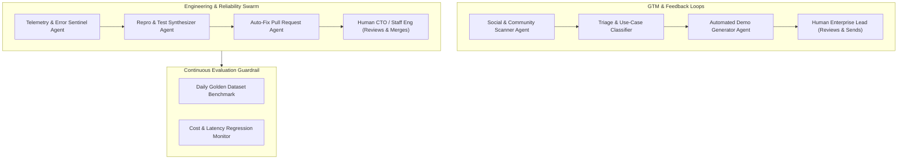

# Four Questions — SuperDocs Assessment

**Candidate:** Irshad Ahmad  
**Repository:** [github.com/Irshad-Ahmaed/doctask-irshad-ahmad](https://github.com/Irshad-Ahmaed/doctask-irshad-ahmad)  

---

### Question 1: What broke? (Bugs, rough edges, and confusing moments hit while using SuperDocs)
1. **JSON-Encoded Proposed Changes**:
   * *Issue:* The `proposed_changes` field in the chat response is returned as a JSON-encoded string rather than a parsed JSON object in certain payload shapes. Missing a secondary deserialization (`json.loads()`) caused empty diff cards where fields read as `undefined`.
   * *Fix:* Implemented defensive double-decoding in our SDK client wrapper.
2. **Angle-Bracket Token Stripping in Chat Turns**:
   * *Issue:* Prompting SuperDocs with `<PAGE>` or `<NUMPAGES>` in natural language chat turns caused the cloud LLM to strip the angle brackets as raw HTML/XML tags and inject the literal phrase `"Page of"` into the document body.
   * *Fix:* Decoupled natural language revision commands from dynamic pagination tokens; layered with PyMuPDF dynamic footer stamping.
3. **Cold-Start Session Latency**:
   * *Issue:* The initial request on a fresh session can take 20–30s with zero streaming progress while models warm up.
   * *Fix:* Implemented pre-seeded HTML document templates (`build_report_template`) and client-side animated progress indicators to eliminate dead time.

---

### Question 2: If you were running this company, what one number would you watch every morning, and why that one?
**The North Star Metric:** **`Document Edit Acceptance Rate (DEAR)`**
$$\text{DEAR} = \frac{\text{Approved In-Place Edits}}{\text{Total Proposed AI Edits}}$$

* **Why this number?**
  * Generating documents from scratch is a commodity. SuperDocs' core defensibility is **targeted, in-place document editing that humans actually trust and accept**.
  * If DEAR is high (>85%), users are accepting targeted diffs directly without manual copy-paste reverts; this drives retention, word-of-mouth adoption, and willingness to pay.
  * If DEAR drops below 70%, it signals that the model is making broad, unwanted rewrites or breaking document structure, creating user fatigue.

---

### Question 3: Name five features you would build next, in order. Say what you would drop, and what frictions/bugs you would fix immediately.

#### Five Features to Build Next:
1. **Streaming Diff Card Generation (SSE)**: Stream individual paragraph-level proposed edits to the client in real-time as the LLM generates them, reducing perceived latency from 20s to <1s.
2. **First-Class Document Parts & Dynamic Paged Media API**: Direct JSON endpoints for headers, footers, page numbering (`@bottom-center`), and margin rules without requiring chat-prompt phrasing.
3. **Deterministic Multi-Turn Session Branching / Undo**: Tree-based version history allowing users to fork a revision, test alternative prompts, and revert non-destructively.
4. **Native MCP Server Package on PyPI/npm**: Official `pip install superdocs-mcp` enabling Cursor, Claude Code, and Windsurf to connect directly to SuperDocs in one click.
5. **Batch Corpus Ingestion & Semantic Conflict Detection**: Multi-document ingestion pipeline that flags contradictions across related contracts, manuals, and invoices.

#### What to Drop:
* Drop standalone generative templates that produce generic boilerplate from scratch; double down entirely on the **in-place targeted editing engine**.

#### Frictions / Bugs to Fix Immediately:
* Fix inconsistent double JSON-string encoding in `proposed_changes`.
* Return explicit progress SSE heartbeats during long cloud PDF exports so client frontends never appear hung.

---

### Question 4: How would you build day-to-day dev and GTM operations so they run themselves (20 to 100 agents with humans steering)?

1. **Autonomous Issue-to-PR Engine**:
   * Sentry/telemetry agent intercepts API 500s $\rightarrow$ generates a minimal reproducing test case $\rightarrow$ spawns a coding agent to open a candidate PR $\rightarrow$ runs regression test suite $\rightarrow$ notifies human engineer on Slack for a 1-click merge.
2. **Targeted Outbound & Demo Pipeline**:
   * Ingestion agent monitors public regulatory updates (e.g. FAA ADs, SEC filings) $\rightarrow$ creates a live revision diff on SuperDocs $\rightarrow$ generates a tailored 1-page sample $\rightarrow$ stages an email draft for human GTM review.
3. **Where Humans Stay in the Loop**:
   * Deployments to production, pull request merges, customer-facing outreach, and pricing changes **always require explicit human approval**.
4. **What Breaks First**:
   * Context drift and agent loop exhaustion when unhandled exceptions occur. Defended by strict token budgets, max retry thresholds, and automatic escalation gates.
