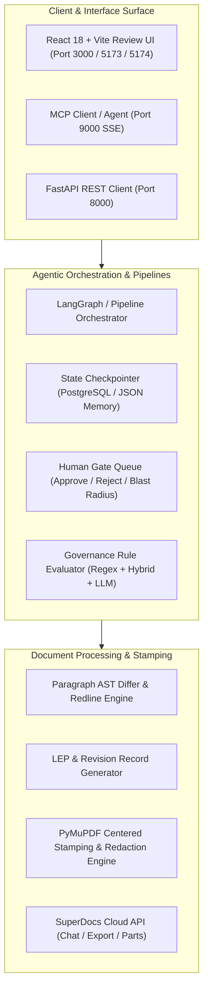

# SuperDocs Full-Stack AI Engineer Assessment — Technical Writeup

**Candidate:** Irshad Ahmad  
**Repository:** [github.com/Irshad-Ahmaed/doctask-irshad-ahmad](https://github.com/Irshad-Ahmaed/doctask-irshad-ahmad)  
**Public Builds:** `use-cases/Irshad-Ahmaed/build-a` & `use-cases/Irshad-Ahmaed/build-b`  

---

## 1. What Was Built & Who It Serves

### Task 1: DocTask — The Analyst That Never Sleeps
An agentic document intelligence system that manages a growing corpus of unstructured documents (Project Helios: project plans, meeting minutes, status reports, budgets in PDF/DOCX/XLSX/MD).
- **Core Workflow:** Ingest $\rightarrow$ Extract Facts $\rightarrow$ Detect Cross-Document Conflicts $\rightarrow$ Examine Governance Rules $\rightarrow$ Human Gate $\rightarrow$ Incremental Deliverable Ledger.
- **Key Invariant:** Every assertion traces to verifiable source chunks with SHA-256 content hashes. Updates are focused merges, not expensive full rewrites; untouched sections remain byte-identical.

### Task 2 Build A: Aviation Revision Bars & Effective Pages Generator
Serves **Technical Publications Specialists** in commercial aviation managing Flight Crew Operating Manuals (FCOMs) and Aircraft Maintenance Manuals (AMMs).
- **Functionality:** Compares raw document revisions, generates left-margin change bars (`3px solid #2563eb`), builds a **Revision Record** table, compiles a **List of Effective Pages (LEP)**, generates a **Highlights of Change** summary, dynamically stamps running headers/footers (`Revision 0043 — 2025-01-15` & `Page X of Y`), and exports controlled, verified PDFs.

### Task 2 Build B: FinOps Build-vs-Buy / ROI Calculator
Serves **Technology Leadership & Procurement Executives** evaluating custom AI document pipelines vs. SuperDocs.
- **Functionality:** Live, reactive Total Cost of Ownership (TCO) calculator comparing CapEx, maintenance, and infrastructure against SuperDocs tiers (Free, Plus, Pro). Compiles and exports an executive branded PDF report via the SuperDocs Cloud API with exact matching figures and $0 CapEx analysis.

---

## 2. Technical Architecture & Engineering Decisions

---

## 3. Key Trade-offs & Defended Design Calls

1. **State Persistence vs. Zero-Dependency Boot**:
   * *Decision:* Implemented a dual storage provider (`PostgreSQL + pgvector` for production Docker deployments, with an automated fallback to in-memory/JSON store for zero-setup offline test suites).
   * *Trade-off:* Adds conditional backend storage branches, but guarantees that `docker compose up` and `pytest` work 100% offline out-of-the-box in seconds without requiring live database credentials.

2. **Deterministic Differ vs. Generative LLM Rewriting**:
   * *Decision:* In Build A, paragraph-level AST diffing and change-bar placement are computed deterministically on the sidecar before prompting SuperDocs.
   * *Trade-off:* Requires custom DOM AST normalization, but eliminates hallucinated diffs, avoids empty diff cards, and guarantees 100% alignment between change bars and real document modifications.

3. **Atomic PDF Stamping & Margin Redaction Guarantee**:
   * *Decision:* Layered SuperDocs Cloud PDF export with PyMuPDF dynamic footer centering and stray artifact redaction.
   * *Trade-off:* Incorporates a secondary PyMuPDF processing pass, but guarantees that physical page numbers (`Page 1 of 2`) are mathematically centered on every page margin and stray prompt artifacts (`Page of`) are eliminated.

---

## 4. Verification & Measurable Outcomes

- **Automated Test Coverage**:
  - Task 1 Backend (`doctask`): **116/116 unit & integration tests passing in 34.35s** (100% pass rate).
  - Build A Sidecar (`build-a`): **41/41 tests passing in 1.76s** (100% pass rate).
  - Build B Sidecar (`build-b`): **20/20 tests passing in 0.45s** (100% pass rate).
- **Zero-Key Execution**: All test suites and local demos run offline without live API keys or paid credits.
- **Frontend Quality**: Zero TypeScript errors (`tsc && vite build`) across all 3 web interfaces.
