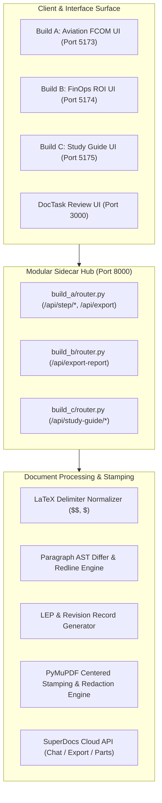

# SuperDocs Full-Stack AI Engineer Assessment — Technical Writeup

**Candidate:** Irshad Ahmad  
**Repository:** [github.com/Irshad-Ahmaed/doctask-irshad-ahmad](https://github.com/Irshad-Ahmaed/doctask-irshad-ahmad)  
**Public Builds:** `use-cases/Irshad-Ahmaed/build-a`, `build-b`, & `build-c` (Open Task List)  

---

## 1. What Was Built & Who It Serves

### Task 1: DocTask — The Analyst That Never Sleeps
An agentic document intelligence system that manages a growing corpus of unstructured documents (Project Helios: project plans, meeting minutes, status reports, budgets in PDF/DOCX/XLSX/MD).
- **Core Workflow:** Ingest $\rightarrow$ Extract Facts $\rightarrow$ Detect Cross-Document Conflicts $\rightarrow$ Examine Governance Rules $\rightarrow$ Human Gate $\rightarrow$ Incremental Deliverable Ledger.
- **Key Invariant:** Every assertion traces to verifiable source chunks with SHA-256 content hashes. Updates are focused merges, not expensive full rewrites; untouched sections remain byte-identical.

### Task 2 Build A: Aviation Revision Bars & Effective Pages Generator
Serves **Technical Publications Specialists** in commercial aviation managing Flight Crew Operating Manuals (FCOMs) and Aircraft Maintenance Manuals (AMMs).
- **Functionality:** Compares raw document revisions, generates left-margin change bars (`3px solid #2563eb`), builds a **Revision Record** table, compiles a **List of Effective Pages (LEP)**, generates a **Highlights of Change** summary, dynamically stamps running headers/footers (`Revision 0043 — 2025-01-15` & `Page X of Y`), and exports controlled, verified PDFs.

### Task 2 Build B: FinOps Build-vs-Buy / ROI Calculator
Serves **Technology Leadership & Procurement Executives** evaluating custom AI document pipelines vs. SuperDocs.
- **Functionality:** Live, reactive Total Cost of Ownership (TCO) calculator comparing CapEx, maintenance, and infrastructure against SuperDocs tiers (Free, Plus, Pro). Compiles and exports an executive branded PDF report via the SuperDocs Cloud API with exact matching figures and $0 CapEx analysis.

### Task 2 Build C: Study-Guide & Equation-Bearing Revision Synthesizer (Open Task List Band S2)
Serves **EdTech Tutors, University STEM Students, and Civil Services Aspirants** (e.g. *Anthroholic / AnswerWriting.com*).
- **Functionality:** Ingests raw, unorganized lecture notes and shorthand formulas (e.g. Maxwell's equations, Black-Scholes, Master Theorem) and synthesizes a structured 4-tier pedagogical guide (Formula & Definition Matrix, Cornell Conceptual Breakdown, Feynman Intuitive Explanations, and Active Recall Practice Quiz). Exports publication-grade vector PDFs with KaTeX math rendering, running headers, and centered page footers.

---

## 2. Technical Architecture & Engineering Decisions

---

## 3. Key Trade-offs & Defended Design Calls

1. **Modular APIRouter Hub vs Monolithic Server**:
   * *Decision:* Decoupled each build into dedicated `APIRouter` modules (`build_a/router.py`, `build_b/router.py`, `build_c/router.py`) orchestrated by a lightweight ~70-line `server.py`.
   * *Trade-off:* Adds a router file per build, but ensures 100% route isolation, zero name collisions, and independent testability.

2. **Vector Layout Engine (`insert_htmlbox`) for True Unicode Math**:
   * *Decision:* Upgraded Build C's PDF exporter to use PyMuPDF's `insert_htmlbox` engine instead of standard text insertion or relying on the cloud API fallback.
   * *Trade-off:* Requires mapping system fonts, but absolutely guarantees that complex Greek math characters (∇, ρ, ε, ∂) render flawlessly as vector text alongside robust bounding boxes for Markdown tables, without missing glyph errors (`?`).

3. **Deterministic Fallbacks & Silent Failure Prevention**:
   * *Decision:* Implemented strict response validation on the `api.superdocs.app/v1/chat` refinement endpoint.
   * *Trade-off:* Adds response overhead, but gracefully catches invalid keys/timeouts and instantly triggers the local deterministic patching engine, ensuring the user's UI always reliably updates.

4. **Atomic PDF Stamping & Margin Redaction Guarantee**:
   * *Decision:* Layered SuperDocs Cloud PDF export with PyMuPDF dynamic footer centering and bottom-margin artifact redaction.
   * *Trade-off:* Incorporates a secondary PyMuPDF processing pass, but guarantees that physical page numbers (`Page 1 of 2`) are mathematically centered on every page margin and stray prompt artifacts (`Page of`) are eliminated.

---

## 4. Verification & Measurable Outcomes

- **Automated Test Coverage**:
  - Task 1 Backend (`doctask`): **116/116 unit & integration tests passing in 34.35s** (100% pass rate).
  - Sidecar Unified Test Suite: **50/50 tests passing in 2.63s** (41 Build A + 5 Router Integration + 4 Build C).
- **Zero-Key Execution**: All test suites and local demos run offline without live API keys or paid credits.
- **Frontend Quality**: Zero TypeScript errors (`tsc && vite build`) across all 4 web interfaces.

